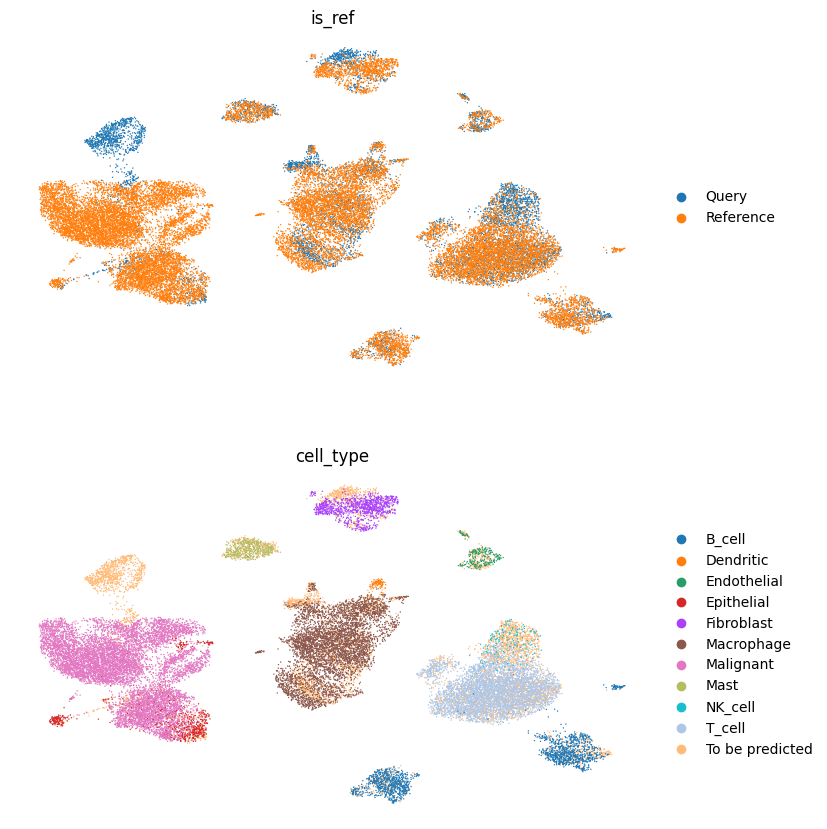
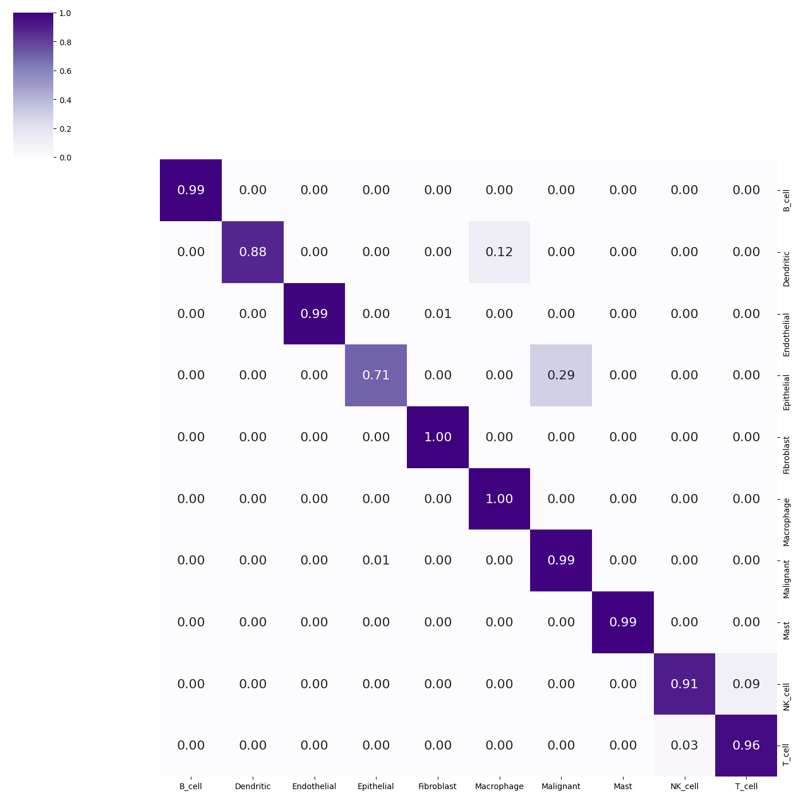

# scGPT-ZeroShot-Reference-Mapping


An end-to-end zero-shot cell-type annotation pipeline that uses the pretrained **scGPT** foundation model to embed lung cancer scRNA-seq data and transfer reference cell-type labels to unlabeled query cells covering embedding generation, UMAP visualization, k-NN label transfer, and full evaluation with **no fine-tuning required**.

Applied here to a **non-small-cell lung cancer scRNA-seq dataset**, this pipeline achieves **96.95% accuracy** and a **95.20% macro F1-score** in recovering ground-truth cell-type labels for query cells it never saw during training.

---

## Overview

Manually annotating cell types in single-cell RNA-seq data is slow, subjective, and requires deep domain expertise. This project shows that scGPT's pretrained embeddings alone with **zero fine-tuning**  are expressive enough to power accurate cell-type transfer via a simple nearest-neighbor vote in embedding space.

**Pipeline at a glance:**

```
Raw reference (labeled)  ──┐
                            ├──► scGPT_human encoder ──► Joint embedding space ──► kNN majority vote ──► Predicted labels
Raw query (unlabeled)    ──┘
```

1. Load a pretrained `scGPT_human` checkpoint (no training/fine-tuning step).
2. Embed a labeled **reference** set and an unlabeled **query** set into scGPT's latent cell-embedding space.
3. Concatenate both embeddings and visualize with UMAP to inspect batch mixing and cluster structure.
4. For each query cell, find its **10 nearest neighbors** (Euclidean distance) among reference cells and transfer the **majority-vote** cell type.
5. Evaluate predictions against ground-truth query labels (accuracy, precision, recall, macro F1, confusion matrix).

---

## Results

| Metric | Score |
|---|---|
| **Accuracy** | 0.9695 |
| **Precision (macro)** | 0.9673 |
| **Recall (macro)** | 0.9409 |
| **Macro F1** | 0.9520 |

The per-class confusion matrix and pre-mapping UMAP visualization are included in [`figures/`](./figures):

**Reference vs. query cells in scGPT embedding space** (colored by dataset origin and cell type):



**Row-normalized confusion matrix** — per-cell-type prediction accuracy:



These results confirm that scGPT's pretrained representation generalizes well across samples/patients within the same tissue context, even without any task-specific training.

---

## Dataset

The pipeline is demonstrated on a processed **lung cancer scRNA-seq** dataset, split into:

| Split | File | Cells | Role |
|---|---|---|---|
| Reference | `data/sample_proc_lung_train.h5ad` | 23,185 | Labeled — provides cell-type ground truth |
| Query | `data/sample_proc_lung_test.h5ad` | 7,287 | Unlabeled during mapping — used for evaluation |

Each `AnnData` object includes:
- `sample` — patient/sample ID (e.g., `P0034`)
- `source` — tissue/biopsy source (e.g., tumor lung `tLung`, tumor lymph node/bronchus `tL/B`)
- `cell_type` — ground-truth annotation (e.g., `Malignant`, `Epithelial`, `T_cell`, `B_cell`, `Macrophage`, `NK_cell`)
- `subclone` — binary malignant subclone indicator
- `complexity` — per-cell transcript/gene complexity

> **Note:** Gene names are expected under the `gene_name` column and are matched against scGPT's vocabulary at embedding time (~99% of genes matched in this dataset).

---

## Pretrained Model

This project uses the pretrained **`scGPT_human`** whole-human foundation model checkpoint (no fine-tuning).

📦 **Download the model checkpoint:** [Google Drive](https://drive.google.com/drive/folders/1oWh_-ZRdhtoGQ2Fw24HP41FgLoomVo-y)

After downloading, place the checkpoint files inside the `model/` directory so the structure looks like:

```
model/
├── args.json
├── best_model.pt
└── vocab.json
```

---

## Repository Structure

```
scGPT-ZeroShot-Reference-Mapping/
├── data/                                    # Reference & query .h5ad files, embeddings cache
├── figures/
│   ├── confusion_matrix.png                 # Per-cell-type prediction accuracy
│   └── umap_before_reference_mapping.png    # Joint UMAP of reference + query embeddings
├── model/                                   # Pretrained scGPT_human checkpoint (see above)
├── reference_mapping.ipynb                  # End-to-end pipeline: embed → map → evaluate
├── environment.yml                          # Conda environment specification
├── requirements.txt                         # Pip dependencies
├── LICENSE
└── .gitignore
```

---

## Installation

**Requirements:** Python 3.9, Conda (recommended)

```bash
# Clone the repository
git clone https://github.com/Prathiksha-Ramesh/scGPT-ZeroShot-Reference-Mapping.git
cd scGPT-ZeroShot-Reference-Mapping

# Option 1: Create environment from environment.yml
conda env create -f environment.yml
conda activate scgpt

# Option 2: Install via pip into an existing environment
pip install -r requirements.txt
```

Key dependencies:
- `scgpt` — pretrained foundation model & embedding utilities
- `scanpy` / `anndata` — single-cell data handling
- `faiss-cpu` — fast similarity search (optional but recommended)
- `scikit-learn` — k-NN classification & evaluation metrics
- `seaborn` / `matplotlib` — visualization

> ⚠️ `flash-attn` is optional. Without it, scGPT falls back to a standard PyTorch transformer implementation (used by default in this notebook, including on CPU-only machines).

---

## Usage

1. **Download the pretrained model** from the [Google Drive link above](#pretrained-model) into `model/`.
2. **Place your reference and query `.h5ad` files** in `data/` (or use the provided lung cancer dataset).
3. **Open and run the notebook:**

```bash
jupyter notebook reference_mapping.ipynb
```

The notebook walks through each stage sequentially:

| Step | Description |
|---|---|
| 1. Setup | Import scGPT and dependencies |
| 2. Embed reference | Generate scGPT embeddings for the labeled reference set |
| 3. Embed query | Generate scGPT embeddings for the unlabeled query set |
| 4. Concatenate | Merge reference + query embeddings into a shared space |
| 5. Mask labels | Hide query cell-type labels to simulate a true zero-shot scenario |
| 6. Visualize | UMAP of the joint embedding space |
| 7. Map & transfer | k-NN (k=10) majority-vote label transfer from reference → query |
| 8. Evaluate | Accuracy, precision, recall, macro F1, confusion matrix |

To adapt this to your own data, simply point `adata` / `test_adata` to your own `.h5ad` files and set `cell_type_key` / `gene_col` to match your metadata column names.

---

## Method Notes

- **Why zero-shot?** scGPT's pretrained embeddings already encode rich biological structure learned from tens of millions of cells. This means cell-type transfer can work well *without* any dataset-specific fine-tuning — ideal when labeled training data is scarce.
- **Why k-NN majority vote?** It's a simple, interpretable baseline for label transfer: each query cell inherits the most common label among its closest reference neighbors in embedding space (Euclidean distance, k=10).
- **Limitations:** As an experimental zero-shot approach, performance depends on how well the query tissue/cell-type context is represented in scGPT's pretraining corpus. Hyperparameters (e.g., k, distance metric) are kept at reasonable defaults rather than exhaustively tuned.

---

## Citation

If you use this pipeline, please cite the original scGPT paper:

> Cui, H., Wang, C., Maan, H., Pang, K., Luo, F., Duan, N. & Wang, B. scGPT: toward building a foundation model for single-cell multi-omics using generative AI. *Nature Methods* **21**, 1470–1480 (2024). https://doi.org/10.1038/s41592-024-02201-0

```bibtex
@article{cui2024scgpt,
  title={scGPT: toward building a foundation model for single-cell multi-omics using generative AI},
  author={Cui, Haotian and Wang, Chloe and Maan, Hassaan and Pang, Kuan and Luo, Fengning and Duan, Nan and Wang, Bo},
  journal={Nature Methods},
  volume={21},
  pages={1470--1480},
  year={2024},
  publisher={Nature Publishing Group},
  doi={10.1038/s41592-024-02201-0}
}
```

---

## License

See [LICENSE](./LICENSE) for details.

## Acknowledgments

- [bowang-lab/scGPT](https://github.com/bowang-lab/scGPT) for the pretrained foundation model and embedding utilities this project builds on.
